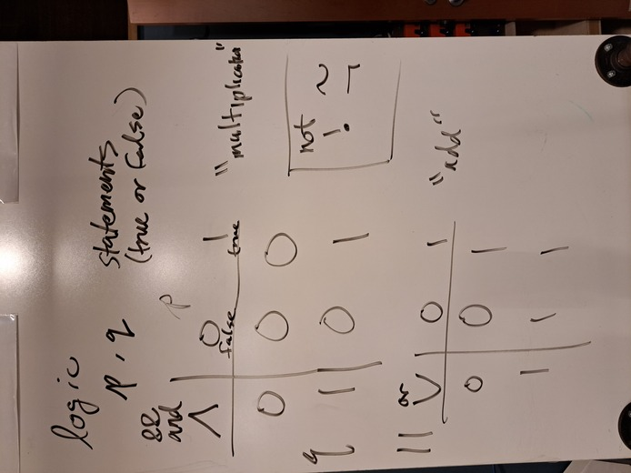
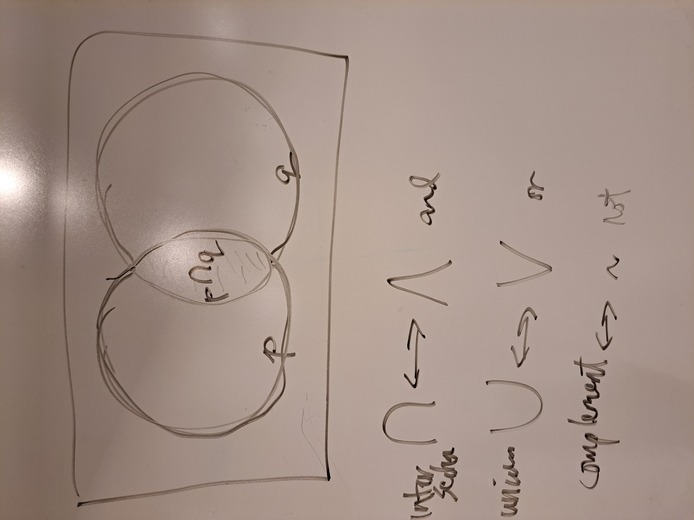
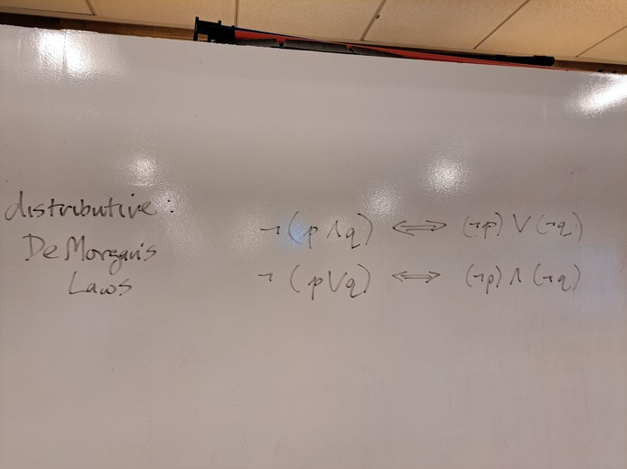

# Unit 2 - Functions and Testing

Topics:

- (static) functions: arguments, return types

- conditions and logical operators
    - relational operators `==`, `<`, etc.
    - logical operators: `&&`, `||`, `!`

- truth tables: and, or, not

- logic and set theory

- De Morgan's Laws

- unit testing

[http://codingbat.com/java/Warmup-1](http://codingbat.com/java/Warmup-1)

## Demo

- <a href="../unit2_demo/HelloFunctions.java">HelloFunctions.java</a>
- <a href="../unit2_demo/MonkeyTrouble.java">MonkeyTrouble.java</a>

